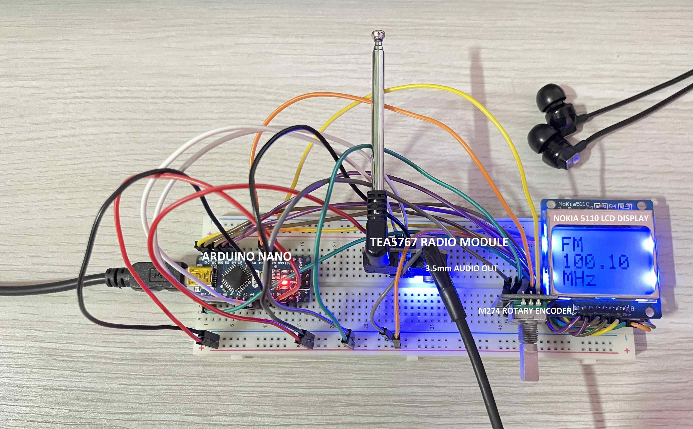
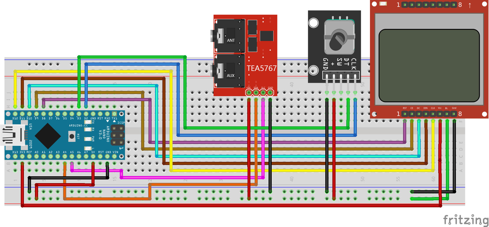

# FM Radio

&nbsp;  

## Schematic

&nbsp;  

## Prerequisite Parts
- **``TEA5767``** (radio module)
- **``Rotary Encoder``** (to change frequency)
- **``NOKIA 5110 LCD``** (display)
- **``Arduino Nano``**
